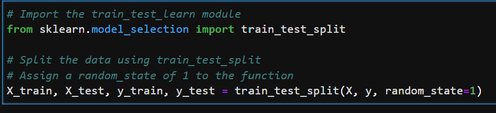
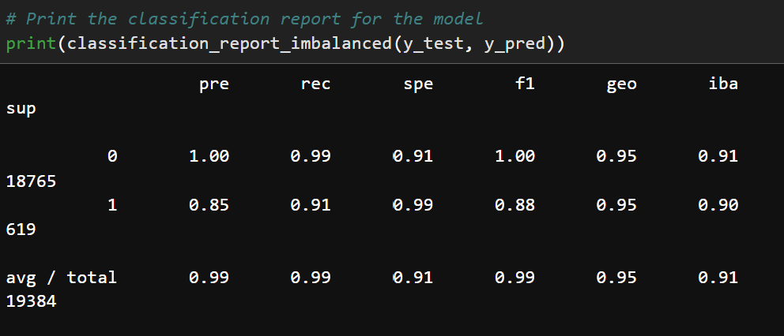
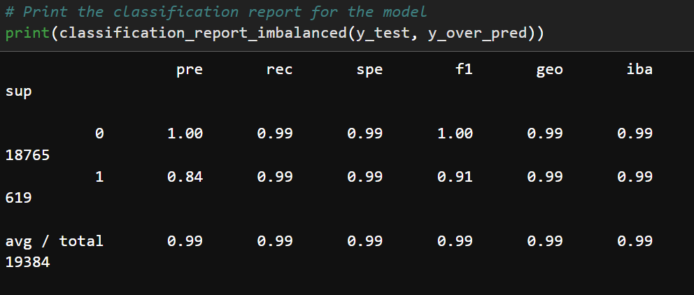

# Module 12 - Credit Risk Analysis Report 
---
## *Analysis*

The purpose of the analysis was to find a machine learning model that will be able to correctly identify a borrower's likelyhood of paying out a loan or defaulting on it. To do this, we were provided with a csv file containing information on varous borrowers':
- loan size
- interest rate
- borrower income
- debt-to-income ratio
- num of accounts
- derogatory marks
- total debt
- loan status

This data was taken and divided into two Dataframes - the X and y variables. The one we are predicting is the y variable y variable and in our case it is the loan status. the X variable are the features that will help the machine learning model in testing and training and properly predicting the outcomes of a possible borrower's likelyhood to default.

To begin the machine learning process, the data that was divided into the y and X variables was now to be further divided into test and train datasets (as shown in below image).

For this machine learning process, the Logistic Regression model was used, therefore the model was instantiated, fited to our data and then used to predict results using our test dataset. Because our data is imbalanced, after running the model on our original datasets, the Logistic Regression model was then used on our data once it was resampled using the Oversampling method. The following images show the resulting classification reports for the data.

Logistic Regression model without resampling the data:

Logistic Regression model with oversampling the data:

## *Results*

* Machine Learning Model 1:
  * Description of Model 1 Accuracy, Precision, and Recall scores.
  * Balanced accuracy score was 95.2%
  * Precision was 85% for high risk loans 
  * Recall was 91% for high risk laons

* Machine Learning Model 2 (oversampled):
  * Description of Model 2 Accuracy, Precision, and Recall scores.
  * Balanced accuracy score was 99.4%
  * Precision went down to 84% for high risk loans
  * Recall went up to 99% for high risk loans

## *Summary*

With the original machine learning model the predictions for high risk loans is lower than predictions for healthy loans. We would value more predictions of which loans are more likely to be high_risk. Healthy loans have predictions in the high 90%, high-risk loans go as low as 85% prediction accuracy (depending on if we are looking at precision or recall).

On othe other hand, the machine learning model with oversampled data, overall had a much higher accuracy score, even if the precision for high risk loans dropped by a percent. The increase in the accuracy could have been the increase in predicting the recall for high risk loans which increased by 8%. The accuracy increase could also be a result of the increased f1 score, which went up from 88% to 91% with the oversampled dataset.

For this reason the oversampled Logisitic Regression model works best.

